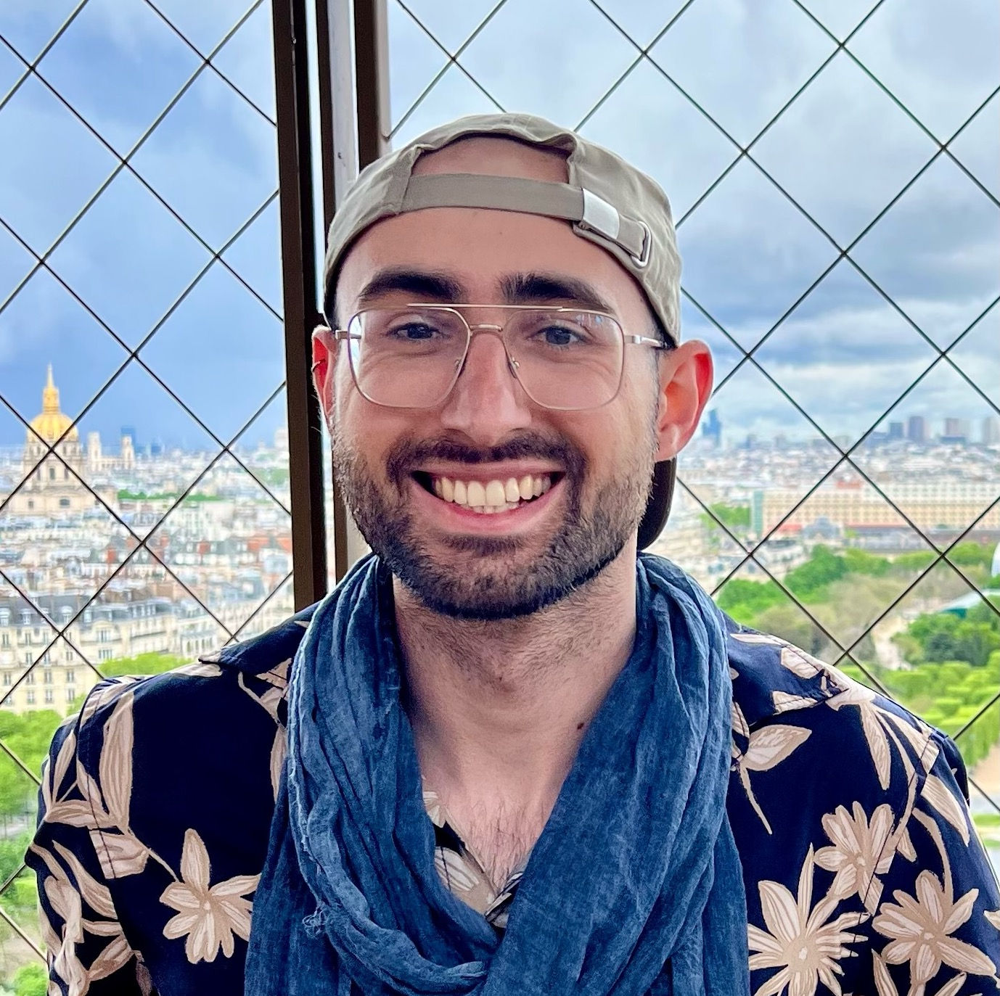

{:style="float: right;margin-left: 25px;margin-top: 7px; margin-bottom: 17px;max-width: 40%;border: 5px solid #3D7C76;border-radius: 28px "}

## Hello,

**I'm Vitor Sudbrack**, Brazilian scientist. I'm currently a PhD student at the *[University of Lausanne](https://www.unil.ch/dee/en/home.html)*, working at the **[Theoretical Evolutionary Ecology lab](https://lab-mullon.github.io/)**  with *Charles Mullon*. 

Studying and researching has allowed me knowing **many nice people, many interesting places and many awesome wonders** of this universe, and I'm very greateful for this.

### My scientific interests

I am very question-driven. Engaging in conversations with people about different topics triggers my passion for mathematical modelling and computer simulations, which has often taken me on various exciting journeys, making it hard for me to narrow down my scientific interests to just one.

However, if I had to pick a focal point, problems steming from biology takes the spotlight for me. For instance, models of **population dynamics, population genetics and complex systems** have been the subject of my work. Often I employ a **diffusion approach** to work on these matters. 

When it comes to simulations, I like to think **I create universes on a computer screen...**, but 95% percent of the job is pogramming and looking at data on this same computer screen *hahah*

I love giving seminars and telling people about my research and other interesting things, specially for outreach purposes. Hence, invitations are always welcome by email! 

### My studies

I have a Master degree in Theoretical Physics (2021) by the *[Institute of Theoretical Physics](https://www.ift.unesp.br/#!/en)* (*IFT - Unesp*) in São Paulo, Brazil, with a sandwich period at the *[Institute for Cross-Disciplinary Physics and Complex Systems](https://www.ifisc.uib-csic.es/en/)* (*IFISC - UiB*) in Palma de Mallorca, Spain. In my Master thesis, I studied *population dynamics in highly fragmented landscapes*.

Before that, I was laureated *Bachelor in Physics with honors* (2019) by the Institute of Physics of the *Federal University of Rio Grande do Sul (UFRGS)* in Porto Alegre, southern Brazil.

### Previous works

Throughout the COVID-19 pandemic, I joined an [Observatory](https://covid19br.github.io) - a collection of scientists from very complementary backgrounds aiming to **understand and analyze the data from COVID-19 in Brazil**. We performed nowcasting and developed modelings. 

During my undergraduate years, I have researched at the *[Fluid Lab - IMPA](http://fluid.impa.br/Home)* with professor *Alexei Mailybaev* in Rio de Janeiro, Brazil. There, we studied fully developed bidimensional turbulence in the case of *Kelvin-Helmholtz instability*. And I worked as well at the *Laboratory for Cellular Structure (LabCel - UFRGS)*, where I described the statistical time evolution of a mathematical model for protein interaction using graphs. 

Since then, I am working with mathematical biology, **uncracking the puzzles of life with mathematical lensing**! 

### Off-science me

When I'm not immersed in the world of science, you can find me exploring my passions in a more laid-back vibe. I enjoy bartending, taking courses and making delightful cocktails for my friends. Strumming on the accordion is my latest pursuit, I enjoy reading about music theory a lot these days. I'm also a huge barista wanna-be! I'm always eager to discover new things about coffee. 

---

##### About this homepage

This is a personal portfolio theme created with Jekyll by  [Grape Academic Theme](https://github.com/chrjabs/Grape-Academic-Theme). Lots of additional codings are my own (*I really have fun doing these things...*). Several of the images are created by aritificial inteligence using the app *AI ART*. 
And as a *little disclaimer:* all opinions in this website are my own and do not necessarily align those of my affiliations.

