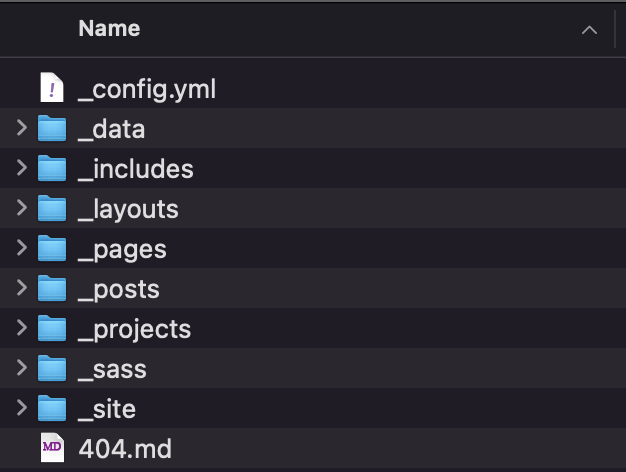
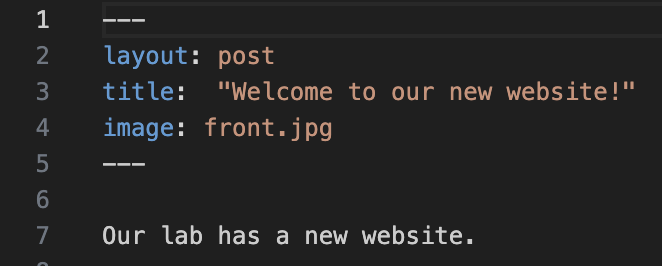

	

###### By myself and [Ehouarn Le Faou](https://elefaou.github.io/), for the DEE Department Retreat, Sept. 3-4th 2023. 


We all do fantastic work in terms of research, but in order to succeed in this increasingly competitive environment, we need to become experts in the tools that allow us to promote and disseminate our amazing discoveries. 

A homepage can be about your personal portfolio, about your lab, or about a specific project you have. Here are some examples of relevant information to add to a homepage would include:
* A description of your research and interests (e.g. [https://estherdale.github.io/research.html](https://estherdale.github.io/research.html) or a bit more like a CV ([https://lenpaul.github.io/academic/](https://lenpaul.github.io/academic/))
* List of your publications (e.g. [https://lab-pannell.github.io/publications/]( https://lab-pannell.github.io/publications/) )
* List of participants in a project (e.g. [https://ictp-saifr-cssm.github.io/past.html](https://ictp-saifr-cssm.github.io/past.html))
* Your funding agencies (e.g. [https://lab.dessimoz.org/](https://lab.dessimoz.org/))
* Manage courses that you are teaching (e.g. [https://lab-mullon.github.io/TEEB](https://lab-mullon.github.io/TEEB)) or have a dedicated page for your long-running course (e.g. [similar to Moodle](https://kazemnejad.github.io/jekyll-course-website-template/))
* Your contacts (e.g. [http://sudbrack.me/contact](http://sudbrack.me/contact))
* Keep people updated with your news (e.g. [https://andreea7b.github.io/](https://andreea7b.github.io/))
* Documentation of a package (e.g. [The Wiredcraft Playbook](https://wiredcraft.github.io/knowledge/?ref=jekyll-themes.com))


Unlike your DEE page, this page is yours and can be customized without bothering Petros and taken anywhere. You can also add a blog to it.  

We hope that by the end of this tutorial, you’ll have a simple page setup that will allow you to get started broadcasting your digital narrative. Together, we'll redefine scientific communication, one click at a time :) 


******
## Overviews

{:style="float: right;margin-left: 25px;margin-top: 7px; margin-bottom: 17px;max-width: 40%;"}

### GitHub Pages 

Users can create and publish websites directly from their GitHub repositories using GitHub Pages, a free hosting service that GitHub offers. It serves as a platform for hosting static websites, documentation, personal portfolios, project pages, and more. GitHub Pages simplifies the process of deploying and maintaining websites, making it a popular choice for both individual developers and larger open-source projects.

{:style="float: right;margin-left: 25px;margin-top: 7px; margin-bottom: 17px;max-width: 40%;"}

### Jekyll templates

Jekyll templates are pre-designed and reusable structures that simplify the process of creating static websites using the Jekyll static site generator. They provide a foundation for organizing content, defining layouts, and styling websites consistently. Jekyll templates typically use the Liquid templating language, allowing developers to dynamically generate content and customize their sites with ease. 

By choosing a Jekyll template, developers can focus on their content and design elements while the underlying structure and functionality are taken care of. These templates cater to various needs, including personal portfolios, blogs, documentation sites, and more, making Jekyll an efficient and flexible tool for building fast and elegant static websites.

******
## Setup

### Create a GitHub repository

* [*Create a repository*](https://docs.github.com/en/get-started/quickstart/create-a-repo): head over to GitHub and create a new public repository named *username.github.io*, where username is your username (or organization name) on GitHub. If the first part of the repository doesn’t exactly match your username, it won’t work, so make sure to get it right.

### Fork and clone a Jekyll template

You can find free and paid templates (between 30 and 100 CHF, single payment). One of the most famous websites for templates is: [https://jekyllthemes.io/](https://jekyllthemes.io/) . 
For instance, the lab-mullon page has the free template *Mundana*, the lab-pannell page has the template *AirSpace*. Our personal pages are based on *Grape Academic Theme*. 

Other options is [https://jekyll-themes.com/](https://jekyll-themes.com/category/academic-website). For instance, [https://andreea7b.github.io/](https://andreea7b.github.io/) comes from the template [Al-Folio](https://jekyll-themes.com/alshedivat/al-folio). 

******
## Customization

{:style="float: right;margin-left: 25px;margin-top: 7px; margin-bottom: 17px;max-width: 40%;"}

### Modify configuration files

- *_config.yml*: this file stores various settings and configurations, such as site title, description, base URL, and other user-defined options.

### Edit content, layouts, and styles

- */_layouts*: Jekyll employs a layout system where you define the structure and HTML markup shared across multiple pages. Layouts provide consistency and enable you to update the design of the entire website by modifying a single template file.

- *_/includes*: Jekyll templates support the use of include files, which allow you to break down your website's structure into reusable components. Includes are particularly helpful for headers, footers, and other repeating elements.

- */_posts* (or generally, “*collections*” and “*/_data*”): Jekyll allows you to organize content using collections, which are groups of related documents. Additionally, you can work with data files in various formats (such as yml, md) to store structured data and use it in your templates. 

Jekyll is Markdown-friendly, meaning you can write content in Markdown syntax, and Jekyll will automatically convert it into HTML. Within your collections, you’ll find the posts and content of your website. They are composed of two parts: [Front Matter](https://jekyllrb.com/docs/front-matter/) and body, separated by `---`. 

******
## Content

{:style="float: right;margin-left: 25px;margin-top: 7px; margin-bottom: 17px;max-width: 40%;"}

### Front Matter

In Jekyll, the Front Matter is a section placed at the beginning of a file (usually a post or page) to provide metadata and configuration options. For a post in Jekyll, some common Front Matter tags include:

1. **layout:** Specifies the layout template to use for rendering the post. For example, `layout: post` will use the "post" layout.

2. **title:** Sets the title of the post.

3. **date:** Indicates the date and time the post was created or published.

4. **categories:** Specifies the categories the post belongs to. It can be a single category or an array of categories.

5. **tags:** Represents the tags associated with the post. It can be a single tag or an array of tags.

6. **author:** Defines the author of the post.

7. **excerpt:** Provides a custom excerpt for the post, which can be used in post lists or previews.

8. **permalink:** Specifies a custom permalink structure for the post, overriding the default URL generation.

9. **published:** Indicates whether the post should be published (`true`) or kept as a draft (`false`).

These Front Matter tags allow you to customize the behavior and appearance of individual posts in your Jekyll site, making it easier to organize, categorize, and present your content effectively.

### Content: Rmarkdown basics

In R Markdown, you can use simple markup syntax to format text, add links, and insert images in your documents. Here are the basic codes for achieving these formatting features:

1. **Bold Text:**
   To make text bold, enclose the text within two asterisks (`**`) or two underscores (`__`).

   Example:
   ```
   This is **bold text**.
   This is __also bold text__.
   ```

2. **Italic Text:**
   To italicize text, enclose the text within single asterisks (`*`) or single underscores (`_`).

   Example:
   ```
   This is *italicized text*.
   This is _also italicized text_.
   ```

3. **Links:**
   To add a link, use square brackets `[]` to represent the link text and parentheses `()` to provide the URL.

   Example:
   ```
   This is a [link to Google](https://www.google.com/).
   ```

4. **Images:**
   To insert an image, use an exclamation mark `!`, followed by square brackets `[]` to add alt text (alternative text), and then parentheses `()` to provide the image URL or file path and, optionally, `{:style="..."}` to add any CSS style. 

   Example:
   ```
   
   ```

These basic codes are easy to use and will help you add formatting and media to your R Markdown documents, making them visually appealing and informative. Remember to render the R Markdown document to the desired output format (e.g., HTML, PDF, or Word) to see the final results with the applied formatting and media elements.

******
## Testing and Deployment

### Test the website locally

If you're using Jekyll to build your website and hosting it on GitHub Pages, it's essential to test your changes locally before pushing them to your GitHub repository. Testing locally allows you to catch any issues or errors before they go live. You can only do that if you use the terminal and a local copy of your files. 

Here's how to do it:

Use Bundler to install the required gems specified in your `Gemfile`:

```bash
bundle install
```

and then build and serve your Jekyll website locally using the following command:

```bash
bundle exec jekyll serve
```

This command will generate your website and make it accessible at `http://localhost:4000`. Open your web browser and visit this URL to view your site. Browse through your website locally to ensure everything looks and functions as expected. Make any necessary changes to your Jekyll project files. The Jekyll development server will automatically rebuild the site as you make changes (except the *_config.yml* file).

### Push changes to GitHub

Once you're satisfied with your local testing and have made any required updates, it's time to push the changes to your GitHub repository. Add your changes to the Git staging area and commit them:

```bash
   git add .
   git commit -m "What's new?"
   git push 
```

******
## Next-level tips

### ‘Inspection’ mode

Google Chrome's Inspection Mode, also known as Developer Tools, is a powerful feature that grants web developers and designers a closer look at the inner workings of a webpage. By simply right-clicking and selecting "Inspect" or using the keyboard shortcut (Ctrl + Shift + I on Windows, Cmd + Option + I on Mac), users gain access to a real-time view of the HTML, CSS, and JavaScript code behind the page. This invaluable tool allows for on-the-fly modifications to the webpage's structure and style, enabling developers to experiment with changes locally before implementing them on the live site. With Inspection Mode, developers can identify and fix issues, test new functions, optimize design elements, and ensure the website's responsiveness across various devices (see next tip). This indispensable feature accelerates the development process by providing a safe sandbox for creativity and precise debugging, resulting in enhanced user experiences and a polished final product.

### Check on phone

In today's mobile-centric world, ensuring that your web page looks and functions flawlessly on phones has become a paramount necessity. A poorly optimized website can lead to frustrating user experiences, increased bounce rates, and missed opportunities to engage with your audience. To test your page on phones, you can use the Google Chrome function Inspection > *Toggle Device* (Ctrl+Shift+M) and test on any phone or tablet. 


### AI images and text

The fusion of engaging images and captivating text is a paramount element in creating a compelling and unforgettable website. Visually appealing images have the power to immediately capture visitors' attention, evoke emotions, and convey your identity. They enhance the overall aesthetics of your site and play a vital role in storytelling. Equally important is well-crafted text that communicates your message effectively, at the right level, and keeps visitors intrigued and informed. Now, with the advent of AI tools, the process of generating personalized text and images for your homepage has reached new heights of creativity and efficiency. AI-powered language models can craft tailored content that resonates with your audience, and image-generating algorithms can produce custom visuals that match your research and themes. AI can also provide pieces of HTML and CSS code. 
Our suggestions are [Midjourney](https://www.midjourney.org/), AI ART, [ChatGPT](https://chat.openai.com/) and [ChatPDF](https://www.chatpdf.com/). 

### Get Academic icons

Embedding Academic Icons from the [https://jpswalsh.github.io/academicons/](https://jpswalsh.github.io/academicons/) repository into HTML is a seamless process that enriches your content with visually appealing, high-quality icons. Thanks to their vectorized format, these icons maintain exceptional quality regardless of the screen size or resolution. To incorporate them, you can include the icons' CSS library in the `<head>` section of your HTML document using a `<link>` tag, and then utilize them with appropriate HTML tags. 
```
<link rel="stylesheet" href="https://cdn.jsdelivr.net/gh/jpswalsh/academicons@1/css/academicons.min.css">
```

For instance, to add a "GoogleScholar" icon, you would simply use the `<i>` tag with a class that corresponds to the icon name preceded of `ai-`. 
```
<i class="ai ai-google-scholar"></i>
```

Non-academic icons are usually available at [https://fontawesome.com/](https://fontawesome.com/search). 


### StatCounter

Statcounter: Web Analytics Made Easy is a powerful tool that empowers website owners and administrators to gain valuable insights into their website's performance and visitor behavior. Understanding the statistics of who accesses your homepage, where they come from, which pages are most viewed, and which files are downloaded is crucial for making informed decisions and optimizing your online presence. With Statcounter, you can effortlessly track key metrics such as visitor traffic, geographic location, referral sources, and user engagement. This invaluable data allows you to identify trends, target specific demographics, improve content relevance, and enhance the user experience. Armed with these comprehensive analytics, website owners can strategize better, refine their marketing efforts, and ensure that their digital platform caters precisely to the needs of their audience, ultimately driving success and growth in the competitive online landscape.

### Buy an address

Having your own domain for a personal page is a brilliant way to establish a unique online identity and elevate your web presence. A custom domain not only adds a professional touch but also makes it easier for people to remember and find your website. Common domain extensions for personal pages include .com, .me, .name, and .io, among others. To buy a domain online, you can choose from various reputable domain registrars. For about 15 CHF/year, you can have a personalized domain with servers like [GoDaddy Domain names](https://www.godaddy.com/fr-ch/domaines). The price varies a lot depending on the availability of your desired domain. For personal pages, it is common to use some less common extensions, like .me, .co, .io, and .ac, because they are the cheapest. 


### URL shortening

Shortening URLs is a convenient technique that transforms long and complex web addresses into shorter, more manageable links. This not only conserves character space, making them ideal for sharing on posters and presentations, but also provides a user-friendly address that's easy to remember. Whether it's directing people to a specific webpage, sharing resources, or promoting a product, shortened URLs simplify the process of sharing and accessing information. 
You can achieve this by using the tag meta on the header of your page
```
<meta http-equiv="refresh" content="0; url='https://...'" />
```
In addition to making it easier, you can also keep statistics on access to your link. For example,
“Access my latest paper at [www.sudbrack.me/dispersal](https://www.sudbrack.me/dispersal).”
rather than
“Access my latest paper at [www.biorxiv.org/content/10.1101/2023.07.07.548167](https://www.biorxiv.org/content/10.1101/2023.07.07.548167).”


